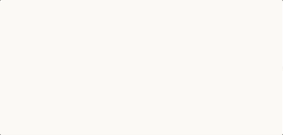

# js-type-text

A framework agnostic typing animation package built with vanilla JavaScript. Works with Vue.js, React, and everything else.



_This animation works with any font! However you will find that it looks its best when paired with [Monospaced fonts](https://en.wikipedia.org/wiki/Monospaced_font) as their letters have a fixed width._


## Installation
```bash
npm install js-type-text
```

### Usage
```js
// import the package
import jsTypeText from 'js-type-text';

// start typing
jsTypeText.start(config, callback);

// stop typing and/or cursor.
jsTypeText.stop();

```

### Configuration
```js
jsTypeText.start({
  text: "Your Text Here",
  speed: 110,
  cursor: true,
  cursorSpeed: 350,
  cursorStyle: "vertical"
}, callback);
```

Value | Type | Required | Description | Default
----- | ----- | ----- | ----- | -----
text  | String | **Required** | The string to be typed. | N/A
speed | Number | **Optional** | Time in ms per character typed. | **`110`**
cursor | Boolean | **Optional** | Show or hide cursor | **`TRUE`**
cursorSpeed | Number | **Optional** | Time in ms per cursor blink. Set to **`0`** to disable blink. | **`350`**
cursorStyle | String | **Optional** | **`"vertical"`** or **`"horizontal"`** or any html character you'd like. For example **`"&#9623;"`**. | **`"horizontal"`** (ie. the underscore symbol **`_`** )


_**Note:** Avoid jitter with custom HTML cursors by setting a CSS `line-height` value._

### Examples

#### Vanilla JS
```js
jsTypeText.start({
  text: "Welcome to my site"
}, function (result) {
  document.getElementById('myElement').innerHTML = result;
});

// optionally stop the typing and/or cursorpoint.
jsTypeText.stop();


```


#### Vue.js

```js
data() {
  return: {
    myTitle: ''
  }
},
created: function () {
  jsTypeText.start({
    text: "Welcome to my site"
  }, (result) => {
    this.myTitle = result;
  })
},
beforeDestroy: function () {
  jsTypeText.stop();
}
```

#### React.js

```js
class myPage extends React.Component{
  state = {
    myTitle:""
  }
  componentDidMount () {
    jsTypeText.start({
      text: "Welcome to my site"
    }, (result) => {
      this.setState({myTitle: result})
    }
  }
  componentWillUnmount () {
    jsTypeText.stop()
  }
  render(){
    return(<h1>{this.state.myTitle}</h1>)
  }
}
```
SIC © [Jared Krause](https://github.com/kravse)
